# GREENSERVECRM

## 1. Project Overview
GreenServe CRM is a Java-based backend application developed to manage and track service requests related to sustainability, such as:
- Solar panel installation
- Waste management
- Pollution control

It allows operations such as:

- Citizen Management: Add,view, update and delete citizen records
- Request Management: Add, view, update,delete service requests and retrieve pending requests using a priority queue


**A console-based interface is included solely for testing and demonstration purposes.**


---

## 2. Technologies Used
- Java (OOP concepts, Enums, Collections)
- MySQL (Relational database)
- JDBC (Java Database Connectivity)
- Java Time API (for date handling)

---

## 3. Database Schema
Tables used:
- `citizen(citizen_id, name, email, phone, address)`
- `technician(technician_id, tech_name, phone, skill_area)`
- `service_type(service_id, service_name)`
- `request(request_id, citizen_id, technician_id, service_id, status, priority, request_date)`

> **Note:** All primary keys (`*_id` fields) are system-generated and set to `AUTO_INCREMENT` in the database.

All tables are interlinked using foreign keys to maintain referential integrity.

### ERD Diagram
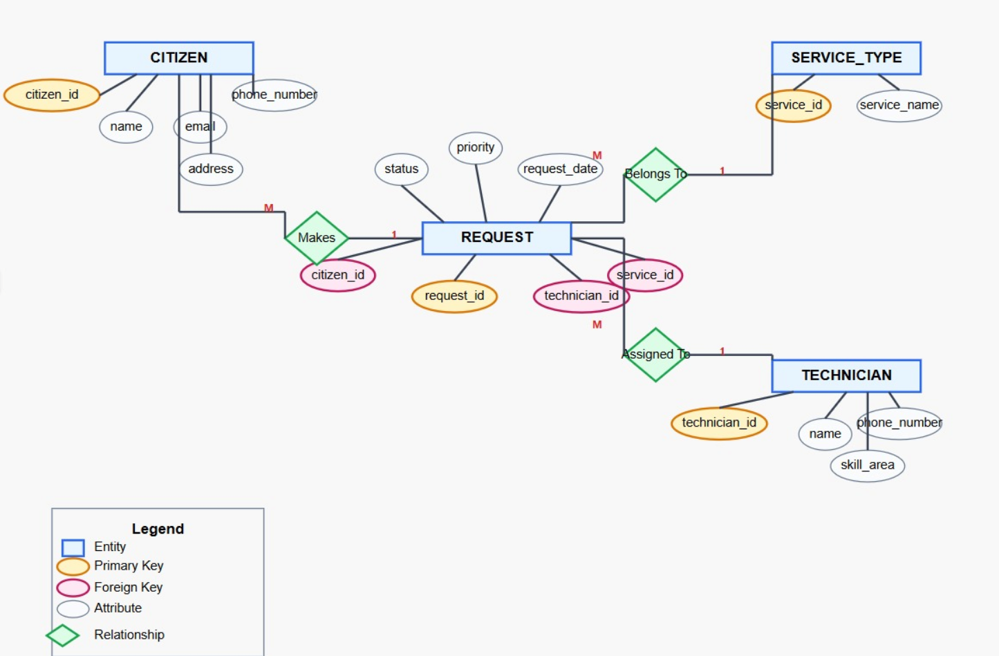


---

## 4. Features Implemented

### Java Class Overview

The project follows an organized object-oriented structure with the following key classes:

#### Core Classes
- **`Person` (abstract)**  
  Base class for all users in the system.  
  Contains common attributes like `id`, `name`, and `phoneNumber`.

- **`Citizen extends Person`**  
  Represents a citizen using the platform.  
  Adds `email` and `address` to the base `Person` class.

- **`Request`**  
  Represents a service request made by a citizen.  
  Includes fields like `requestId`, `citizenId`, `technicianId`, `serviceId`, `status`, `priority`, and `submissionDate`.

- **`ServiceType`**  
  Represents different service categories such as solar panel installation, waste management, etc.

#### Enums
- **`Status`**  
  Enum for request statuses: `PENDING`, `IN_PROGRESS`, `COMPLETED`.

- **`Priority`**  
  Enum for priority levels: `LOW`, `MEDIUM`, `HIGH`.

#### DAO Classes
- **`CitizenDAO`**  
  Handles all database operations related to `Citizen` (CRUD).

- **`RequestDAO`**  
  Handles all database operations related to `Request` (CRUD and filtering by status/priority).

#### Utility
- **`DBUtil`**  
  Provides a utility method for establishing JDBC connections to the MySQL database.

#### Console & Testing
- **`Main`**  
  Interactive console interface for evaluators to test all features such as adding, viewing, updating, and deleting Citizens and Requests.

- **`OldMain`**  
  Used to verify JDBC connection setup before running the full application.


### Functionalities

This project enables efficient management and tracking of citizen service requests with the following features:

#### Citizen Management
- Add a new citizen with basic details (name, phone number, email, address)
- View all registered citizens
- Update a citizen's details using their email
- Delete a citizen using their email

#### Request Management
- Add a new service request with details like technician ID, service id, status, and priority
- View all service requests
- Update an existing request using request ID
- Delete a request using request ID

#### Request Filtering and Prioritization
- Automatically filter and display only `PENDING` requests

#### JDBC Connectivity
- Successfull integration with MySQL database using JDBC to perform CRUD operations on databse using Java.


---

## 5. How to Run

### Prerequisites:
- Java installed (JDK 8+)
- MySQL installed and configured
- **MySQL Connector/J** (JDBC driver)

> Make sure to download and install the [MySQL Connector/J](https://dev.mysql.com/downloads/connector/j/) `.jar` file.
> - Place the `.jar` file in your project folder or configure it in your IDE.
> - If running from terminal, include it in the classpath like this:
```bash
javac -cp ".;mysql-connector-java-8.0.xx.jar" Main.java
java -cp ".;mysql-connector-java-8.0.xx.jar" Main
```
> - Replace `8.0.xx` with the actual version number of the `.jar` file you downloaded.

### Steps:
### Steps:
1. Clone or Download
2. Run the `schema.sql` file in MySQL Workbench to create the database and tables.
3. Update the database credentials in `DBUtil.java`.
4. To verify your JDBC connection, refer to the `OldMainDemo.java` file — it contains a simple test snippet (commented) for checking connectivity before running the full application.


5. Compile and run the application using:
```bash
   javac Main.java
   java Main
```
6. Console Output  
This is the output of a successful JDBC connection:

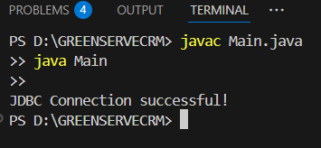
---

## 6. Screenshots(Operations in OldMainDemo.java)

### 6.1 Add Citizen
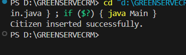

### 6.2 All Citizens in the System
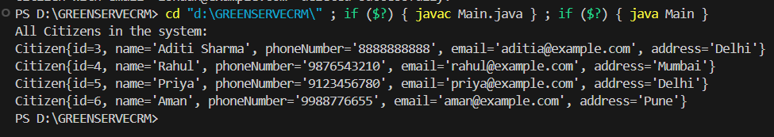

### 6.3 Update Citizen
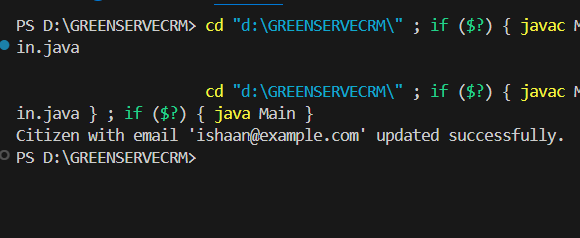

### 6.4 Delete Citizen
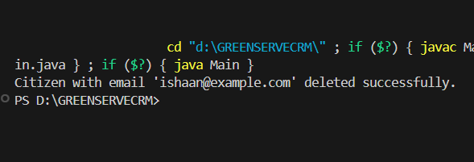

### 6.5 Insert Request
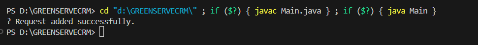

### 6.6 View Request
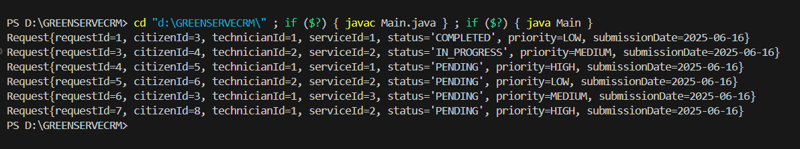

### 6.7 Update Request
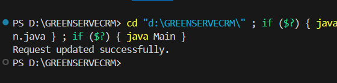

### 6.8 Delete Request


### 6.9 Pending Requests by Priority
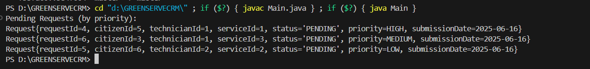

---

## 7. Console(Main.java)
The following screenshot demonstrates how the application looks when running `Main.java`:

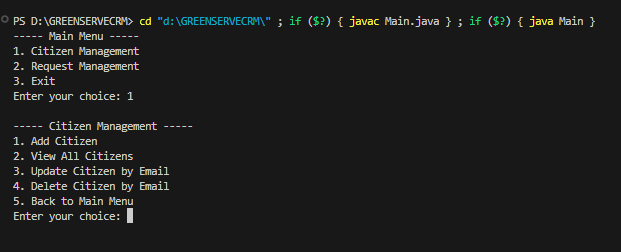

> **ℹ Note for First-Time Users:**  
> While experimenting with **Request Management**, make sure that the `technician` and `service_type` tables contain some entries.  
> Since `request` depends on valid `technician_id` and `service_id`, inserting a request without existing data in those tables will result in a foreign key constraint error.

---

## 8. Future Enhancements

- **User-friendly Input Mapping**:  
  Eliminate the need to manually input IDs (e.g., `citizen_id`, `technician_id`, `service_id`) by allowing references using easily remembered fields like email, technician name, or service type. The system will automatically resolve and map them to the correct IDs.

- **Technician Module**:  
  Implement a complete `Technician` class with full CRUD operations.

- **Role-Based Access Control (RBAC)**:  
  Introduce user roles such as **Admin** and **Citizen**, where:
  - **Admins** can perform all CRUD operations on citizens, requests, technicians, and service types.
  - **Citizens** can view their own requests, submit new requests, and track their status.

- **Service Type Management**:  
  Add functionality to manage service categories (`service_type` table), including adding, updating, and removing service types dynamically.

- **Modular Folder Structure**:  
  Refactor the codebase into a more organized folder structure, separating concerns such as:
  - DAO (Data Access Objects)
  - Models / Entities
  - Utility classes
  - Main application logic

- **Improved Code Maintainability**:  
  Restructure classes to follow standard design patterns (like MVC) and prepare the codebase for potential future migration to a GUI or web-based interface.
